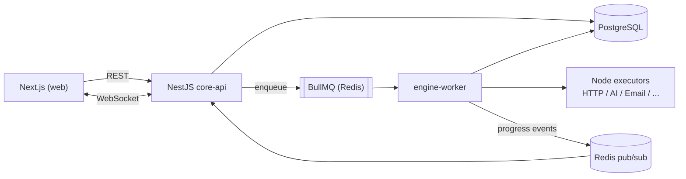

# FlowForge

> A visual workflow automation platform with an AI-assisted builder. Design workflows on a drag-and-drop canvas, trigger them from webhooks or schedules, and watch every execution run step by step in real time.


**Live demo:** _coming soon_ · **Demo video (2 min):** _coming soon_ · **API docs:** _coming soon_

---

## Why FlowForge

Automation tools like Zapier and n8n are everywhere, but building one forces you to solve genuinely hard engineering problems: executing a graph reliably, never running a webhook twice, keeping cron jobs from double-firing across instances, running user-defined logic safely, and streaming progress to the UI.

FlowForge is a focused, production-minded take on that problem. It deliberately ships **few node types done well** instead of dozens done shallowly.

## Example

> "Every morning at 8am, fetch new orders, summarize them with AI, and send the summary to Telegram."

Describe it in plain language, and FlowForge generates a workflow you can inspect and edit on the canvas before saving:

```
[Cron 08:00] → [HTTP: GET /orders] → [AI: summarize] → [Telegram: send message]
```

## Features

**Builder**

- Drag-and-drop canvas (React Flow) with connection validation, undo/redo and autosave
- Dynamic configuration forms generated from each node's schema
- AI text-to-workflow: describe a flow, review the generated graph, then edit it

**Engine**

- Graph (DAG) execution in topological order, with parallel branches
- Per-node timeout, retry with exponential backoff, dead-letter queue
- Resume a failed execution from the failing step
- Idempotent webhook handling (duplicate deliveries do not run twice)
- Cron triggers that fire exactly once even with multiple instances running

**Platform**

- Multi-tenant workspaces with role-based access control (owner / editor / viewer)
- JWT access tokens with refresh-token rotation, plus OAuth2 login
- Encrypted credential storage (AES-256-GCM); secrets are never returned by the API
- Audit log and per-workspace rate limiting
- Real-time execution view over WebSocket, plus run statistics

**AI**

- Structured-output AI node (classify, extract JSON by schema, summarize) with validation and retry
- AI explanation of failed executions
- Provider adapter with response caching and per-workspace token budgets

## Node types (MVP)

| Category     | Nodes                                                      |
| ------------ | ---------------------------------------------------------- |
| Triggers     | Webhook, Cron, Manual                                      |
| Logic        | If / Else, Transform (JSONata)                             |
| Integrations | HTTP Request, Send Email, Telegram / Slack, Postgres Query |
| AI           | Classify, Extract (JSON schema), Summarize                 |

## Architecture



**Modular monolith plus one dedicated worker.** The API is organized into strict NestJS modules (auth, workspace, workflow, execution, credential, ai). The execution engine runs as a separate process because it is the only part with heavy, bursty load and the only part that runs untrusted logic. Modules communicate through services and events, so splitting further later is cheap.

See [`docs/adr`](docs/adr) for the reasoning behind these choices.

## Tech stack

| Layer              | Technology                                                     |
| ------------------ | -------------------------------------------------------------- |
| Frontend           | Next.js, TypeScript, Tailwind CSS, shadcn/ui                   |
| Canvas             | React Flow (`@xyflow/react`)                                   |
| Client state       | Zustand (editor/UI state only)                                 |
| Server state       | TanStack Query                                                 |
| Forms & validation | React Hook Form, Zod (schemas shared with the backend)         |
| Charts             | Recharts                                                       |
| Realtime           | Socket.IO (Redis adapter for multi-instance)                   |
| Backend            | NestJS, TypeScript                                             |
| Database           | PostgreSQL, Prisma (workflow definitions stored as `jsonb`)    |
| Auth               | JWT + refresh-token rotation, OAuth2, RBAC                     |
| Cache / queue      | Redis, BullMQ                                                  |
| AI                 | LLM API with structured output, Zod validation                 |
| Storage            | S3-compatible (MinIO locally)                                  |
| Testing            | Vitest, React Testing Library, Jest, Supertest, Playwright, k6 |
| Observability      | Observe (`@nestjs/observe`): tracing, logs, metrics, alerts    |
| DevOps             | Docker, Docker Compose, GitHub Actions                         |
| Monorepo           | pnpm workspaces, Turborepo                                     |

## Repository structure

```
flowforge/
├─ apps/
│  ├─ web/          # Next.js frontend
│  ├─ api/          # NestJS core-api (REST, WebSocket gateway)
│  └─ worker/       # NestJS engine-worker (queue consumer)
├─ packages/
│  ├─ shared/       # Zod schemas, types, workflow JSON schema
│  └─ node-sdk/     # Node definitions: config schema + execute()
├─ docs/
│  ├─ adr/          # Architecture decision records
│  └─ architecture.md
├─ docker-compose.yml
└─ README.md
```

`node-sdk` is the heart of extensibility: each node type is declared **once** (a Zod config schema plus an `execute` function). The frontend derives the config form from the schema, and the worker runs the function. Adding a node means adding one file.

## Getting started

> The commands below describe the intended workflow and will be finalized as the project is built.

**Prerequisites:** Node.js 20+, pnpm, Docker

```bash
# 1. Clone and install
git clone https://github.com/<your-username>/flowforge.git
cd flowforge
pnpm install

# 2. Configure environment
cp .env.example .env

# 3. Start infrastructure (Postgres, Redis, MinIO)
docker compose up -d

# 4. Apply migrations and seed demo data
pnpm --filter api prisma migrate dev
pnpm --filter api prisma db seed

# 5. Run everything
pnpm dev
```

Web runs on `http://localhost:3000`, API on `http://localhost:4000` (Swagger at `/docs`).

### Environment variables

| Variable                                                        | Description                                            |
| --------------------------------------------------------------- | ------------------------------------------------------ |
| `DATABASE_URL`                                                  | PostgreSQL connection string                           |
| `REDIS_URL`                                                     | Redis connection string                                |
| `JWT_ACCESS_SECRET` / `JWT_REFRESH_SECRET`                      | Token signing secrets                                  |
| `CREDENTIAL_ENCRYPTION_KEY`                                     | 32-byte key for AES-256-GCM credential encryption      |
| `S3_ENDPOINT` / `S3_BUCKET` / `S3_ACCESS_KEY` / `S3_SECRET_KEY` | Object storage                                         |
| `LLM_PROVIDER` / `LLM_API_KEY`                                  | AI provider (`mock` available for offline development) |
| `OAUTH_GOOGLE_CLIENT_ID` / `OAUTH_GOOGLE_CLIENT_SECRET`         | OAuth2 login                                           |
| `OBSERVE_APP_KEY` / `OBSERVE_APP_SECRET`                        | Observe credentials (sign up at observe.nestjs.com)    |

## Key design decisions

Each decision is documented as an ADR in [`docs/adr`](docs/adr):

1. **Modular monolith + dedicated worker** instead of full microservices
2. **BullMQ over RabbitMQ**, since Redis is already required and the queue needs are simple
3. **Execution steps stored as rows**, not a JSON blob, to support querying, resuming and analytics
4. **JSONata for expressions**, with an isolated sandbox for any user code
5. **Transactional outbox** so jobs are never lost between a DB commit and enqueue
6. **Distributed-safe cron** using a single repeatable-job owner per schedule

## Reliability notes

| Concern                      | Approach                                                            |
| ---------------------------- | ------------------------------------------------------------------- |
| Duplicate webhook deliveries | Idempotency key stored with a unique constraint                     |
| Lost jobs on crash           | Transactional outbox + at-least-once delivery with idempotent steps |
| Transient failures           | Exponential backoff, per-node timeout, dead-letter queue            |
| Double-firing schedules      | One repeatable job per schedule, guarded by Redis                   |
| Concurrent edits             | Optimistic locking on workflow versions                             |
| Secret leakage               | AES-256-GCM at rest, write-only credential API                      |
| Runaway AI cost              | Per-workspace token budget, rate limiting, response cache           |

## Testing

```bash
pnpm test          # unit tests (Jest, Vitest)
pnpm test:e2e      # end-to-end (Playwright)
pnpm test:load     # load tests (k6)
```

## Benchmarks

_To be measured and filled in with real numbers as the engine is completed._

| Metric                                            | Result |
| ------------------------------------------------- | ------ |
| Concurrent executions without job loss            | TBD    |
| API p95 latency (cached job listing)              | TBD    |
| Retry success rate on injected transient failures | TBD    |
| AI workflow generation: valid on first attempt    | TBD    |

## Roadmap

- [ ] **Phase 1: Foundation.** Monorepo, auth (JWT + refresh + OAuth2), workspaces, RBAC, Prisma schema, Docker Compose
- [ ] **Phase 2: Engine core.** Workflow definition, queue, sequential execution, HTTP and If/Else nodes
- [ ] **Phase 3: Editor.** React Flow canvas, dynamic node forms, save/load workflows
- [ ] **Phase 4: Triggers & reliability.** Webhook and cron triggers, retry/backoff, idempotency, resume, outbox
- [ ] **Phase 5: Realtime & analytics.** Socket.IO execution view, Recharts dashboard
- [ ] **Phase 6: AI.** Text-to-workflow, AI node, failure explanations
- [ ] **Phase 7: Quality & ops.** Test suites, CI/CD, load tests, OpenTelemetry + Grafana, deployment, ADRs, demo video

**Out of scope for the MVP:** loops, sub-workflows, version history UI, template marketplace, billing.

## Deployment

FlowForge is designed to run on free infrastructure:

- **Web:** Vercel (Hobby)
- **API + worker + Postgres + Redis + MinIO:** a single VM running Docker Compose
- **CI/CD:** GitHub Actions

## Contributing

This is a portfolio project, but issues and suggestions are welcome.

## License

[MIT](LICENSE)
