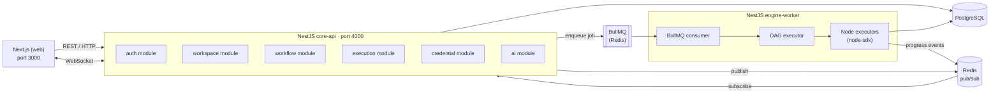

# FlowForge — Architecture

This document describes the high-level architecture and the key boundaries between components.

---

## System diagram



---

## Components

### `apps/web` — Next.js frontend
- **Canvas**: React Flow (`@xyflow/react`) with drag-and-drop, undo/redo, autosave
- **Config forms**: generated at runtime from each node's Zod `configSchema` (from `node-sdk`)
- **AI builder**: text prompt → structured workflow JSON → editable canvas
- **Realtime**: Socket.IO client receives execution progress events over WebSocket
- **State**: Zustand for editor/UI state; TanStack Query for server state

### `apps/api` — NestJS core API
| Module | Responsibility |
|---|---|
| `auth` | JWT access/refresh tokens, refresh rotation, OAuth2 (Google) |
| `workspace` | Multi-tenant workspaces, RBAC (owner / editor / viewer) |
| `workflow` | CRUD for workflow definitions; versioning with optimistic locking |
| `execution` | Create & list runs; stream progress via WebSocket; transactional outbox |
| `credential` | AES-256-GCM encrypted secrets; write-only API (never returned in responses) |
| `ai` | Provider adapter (Gemini / Anthropic / OpenAI / mock); token budgets; response cache |

The API **never** executes workflow nodes directly — it only enqueues jobs.

### `apps/worker` — NestJS engine-worker
- Consumes BullMQ jobs from the `executions` queue
- Executes the workflow DAG in topological order (parallel branches concurrently)
- For each step: validate config → call `node.execute()` → persist result row → publish progress event
- Handles retries (exponential backoff), per-node timeouts, dead-letter queue
- Idempotent: if a step row already exists for this run, it is skipped

### `packages/shared` — Zod schemas & types
- Shared Zod schemas (auth, workspace, workflow JSON format)
- Types inferred from those schemas
- Imported by both `web` and `api` — single source of truth for validation

### `packages/node-sdk` — Node definitions
Each node type is one file that exports a `NodeDefinition`:
```ts
interface NodeDefinition<TSchema extends z.ZodTypeAny> {
  type: string;          // e.g. "http-request"
  label: string;         // displayed on canvas
  category: 'triggers' | 'logic' | 'integrations' | 'ai';
  configSchema: TSchema; // Zod schema → form + runtime validation
  execute(args: ExecuteArgs<z.infer<TSchema>>): Promise<ExecuteResult>;
}
```
- **Frontend** reads `configSchema` to generate the config form
- **Worker** calls `execute()` at runtime
- Adding a new node = adding one file + calling `registerNode()`

---

## Data flow: webhook trigger

```
External system
  → POST /webhooks/:webhookId                   (api)
  → idempotency check (unique constraint)        (postgres)
  → insert execution row + outbox row            (postgres, one tx)
  → outbox poller picks up row                   (api)
  → enqueue BullMQ job                           (redis)
  → consumer picks up job                        (worker)
  → execute DAG step by step
      → persist step result rows                 (postgres)
      → publish progress event                   (redis pub/sub)
  → api gateway forwards event over WebSocket    (web)
```

---

## Data flow: cron trigger

- Each active cron schedule has exactly **one repeatable BullMQ job** (keyed by `scheduleId`)
- When a schedule is enabled/disabled/updated, the old repeatable job is removed and a new one is added atomically
- This guarantees exactly-once firing even with multiple `api` instances running

---

## Reliability

| Concern | Mechanism |
|---|---|
| Lost jobs on crash | Transactional outbox — job is not enqueued until the DB row commits |
| Duplicate webhook deliveries | `idempotencyKey` stored with a unique constraint |
| Double-firing schedules | Single repeatable BullMQ job per schedule |
| Transient node failures | Exponential backoff + per-node timeout; dead-letter queue after max retries |
| Concurrent workflow edits | Optimistic locking on `workflow.version` |
| Secret leakage | AES-256-GCM at rest; credential API never returns plaintext |

---

## Deployment topology (single-VM)

```
┌──────────────────────────── VM ─────────────────────────────┐
│  Docker Compose                                              │
│  ┌─────────┐  ┌─────────┐  ┌───────────┐  ┌─────────────┐  │
│  │  api    │  │ worker  │  │ postgres  │  │   redis     │  │
│  │ :4000   │  │         │  │ :5432     │  │   :6379     │  │
│  └─────────┘  └─────────┘  └───────────┘  └─────────────┘  │
│  ┌──────────────────────┐                                    │
│  │  minio (S3)  :9000   │                                    │
│  └──────────────────────┘                                    │
└──────────────────────────────────────────────────────────────┘
         ▲
         │  Vercel (web — Next.js)
```
